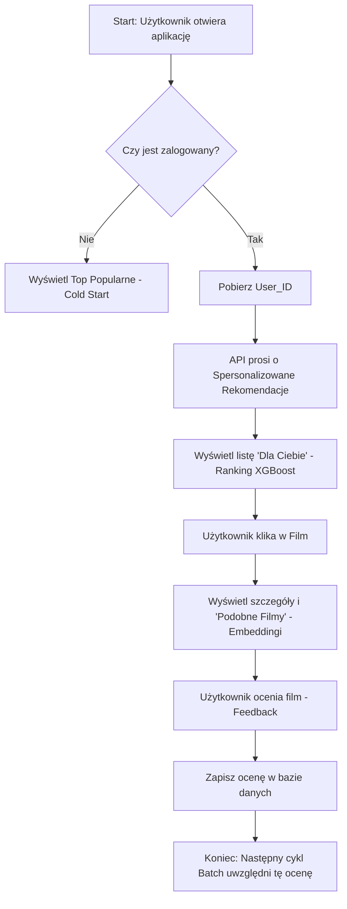
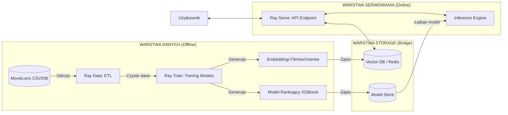

# distributed-sys-movielens

```mermaid
graph TD
    A[Start: Użytkownik otwiera aplikację] --> B{Czy jest zalogowany?}
    B -- Nie --> C[Wyświetl Top Popularne - Cold Start]
    B -- Tak --> D[Pobierz User_ID]
    D --> E[API prosi o Spersonalizowane Rekomendacje]
    E --> F[Wyświetl listę 'Dla Ciebie' - Ranking XGBoost]
    F --> G[Użytkownik klika w Film]
    G --> H[Wyświetl szczegóły i 'Podobne Filmy' - Embeddingi]
    H --> I[Użytkownik ocenia film - Feedback]
    I --> J[Zapisz ocenę w bazie danych]
    J --> K[Koniec: Następny cykl Batch uwzględni tę ocenę]
```

```mermaid
flowchart LR
    subgraph "WARSTWA DANYCH (Offline)"
        DS[(MovieLens CSV/DB)] -- Odczyt --> RD[Ray Data: ETL]
        RD -- Czyste dane --> RT[Ray Train: Trening Modelu]
        RT -- Generuje --> EMB[Embeddingi Filmów/Userów]
        RT -- Generuje --> MOD[Model Rankujący XGBoost]
    end

    subgraph "WARSTWA STORAGE (Bridge)"
        EMB -- Zapis --> VDB[(Vector DB / Redis)]
        MOD -- Zapis --> MS[(Model Store)]
    end

    subgraph "WARSTWA SERWOWANIA (Online)"
        API[Ray Serve: API Endpoint] <--> VDB
        API <--> INF[Inference Engine]
        MS -- Ładuje model --> INF
    end

    U[Użytkownik] <--> API
```
