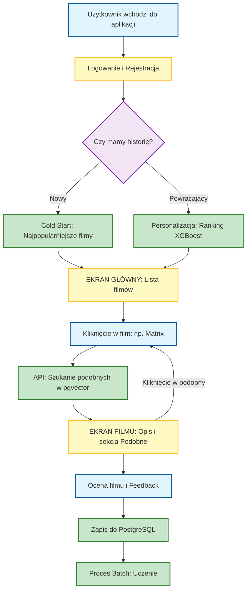
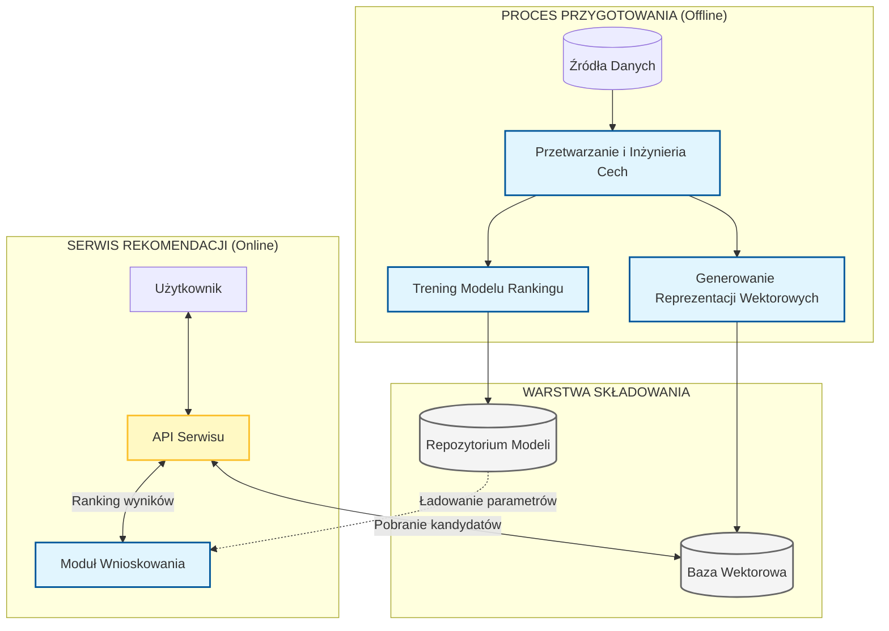
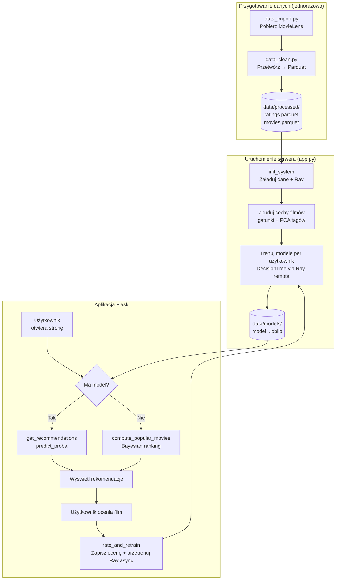

# distributed-sys-movielens

```mermaid
graph TD
    A[Użytkownik wchodzi do aplikacji] --> B[Logowanie i Rejestracja]
    B --> C{Czy mamy historię?}
    C -- Nowy --> D[Cold Start: Najpopularniejsze filmy]
    C -- Powracający --> E[Personalizacja: Ranking XGBoost]
    D --> F[EKRAN GŁÓWNY: Lista filmów]
    E --> F
    F --> G[Kliknięcie w film: np. Matrix]
    G --> H[API: Szukanie podobnych w pgvector]
    H --> I[EKRAN FILMU: Opis i sekcja Podobne]
    I --> J[Ocena filmu i Feedback]
    J --> K[Zapis do PostgreSQL]
    K --> L[Proces Batch: Uczenie]
    I -- Kliknięcie w podobny --> G

    classDef uNode fill:#e1f5fe,stroke:#01579b,stroke-width:2px
    classDef sNode fill:#c8e6c9,stroke:#2e7d32,stroke-width:2px
    classDef iNode fill:#fff9c4,stroke:#fbc02d,stroke-width:2px
    classDef dNode fill:#f3e5f5,stroke:#7b1fa2,stroke-width:2px

    class A,G,J uNode
    class D,E,H,K,L sNode
    class B,F,I iNode
    class C dNode
```

```mermaid
graph TD
    %% Stylizacja
    classDef storage fill:#f4f4f4,stroke:#666,stroke-width:2px;
    classDef process fill:#e1f5fe,stroke:#01579b,stroke-width:2px;
    classDef interface fill:#fff9c4,stroke:#fbc02d,stroke-width:2px;

    subgraph "PROCES PRZYGOTOWANIA (Offline)"
        A[(Źródła Danych)] --> B[Przetwarzanie i Inżynieria Cech]:::process
        B --> C[Trening Modelu Rankingu]:::process
        B --> D[Generowanie Reprezentacji Wektorowych]:::process
    end

    subgraph "WARSTWA SKŁADOWANIA"
        E[(Baza Wektorowa)]:::storage
        F[(Repozytorium Modeli)]:::storage
    end

    subgraph "SERWIS REKOMENDACJI (Online)"
        G[Użytkownik] <--> H[API Serwisu]:::interface
        H <--> |Pobranie kandydatów| E
        H <--> |Ranking wyników| I[Moduł Wnioskowania]:::process
        F -.-> |Ładowanie parametrów| I
    end

    %% Zapisywanie wyników
    C --> F
    D --> E
```

```mermaid
flowchart TD
    subgraph Przygotowanie["Przygotowanie danych (jednorazowo)"]
        A[data_import.py\nPobierz MovieLens] --> B[data_clean.py\nPrzetwórz → Parquet]
        B --> C[(data/processed/\nratings.parquet\nmovies.parquet)]
    end

    subgraph Start["Uruchomienie serwera (app.py)"]
        C --> D[init_system\nZaładuj dane + Ray]
        D --> E[Zbuduj cechy filmów\ngatunki + PCA tagów]
        E --> F[Trenuj modele per użytkownik\nDecisionTree via Ray remote]
        F --> G[(data/models/\nmodel_<userId>.joblib)]
    end

    subgraph Web["Aplikacja Flask"]
        H[Użytkownik\notwiera stronę] --> I{Ma model?}
        I -- Tak --> J[get_recommendations\npredict_proba]
        I -- Nie --> K[compute_popular_movies\nBayesian ranking]
        J --> L[Wyświetl rekomendacje]
        K --> L
        L --> M[Użytkownik ocenia film]
        M --> N[rate_and_retrain\nZapisz ocenę + przetrenuj Ray async]
        N --> F
    end

    G --> I
```
