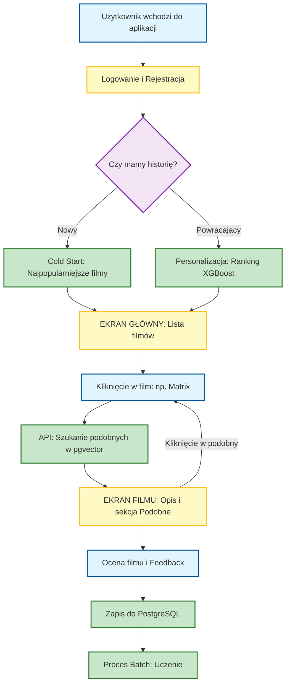
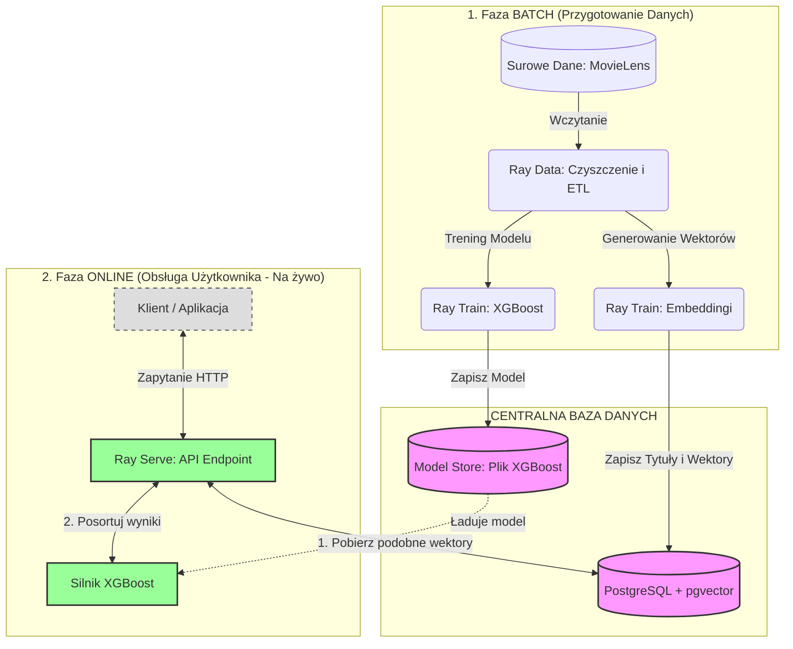

# distributed-sys-movielens

```mermaid
graph TD
    A[Użytkownik wchodzi do aplikacji] --> B[Logowanie i Rejestracja]
    B --> C{Czy mamy historię?}
    C -- Nowy --> D[Cold Start: Najpopularniejsze filmy]
    C -- Powracający --> E[Personalizacja: Ranking XGBoost]
    D --> F[EKRAN GŁÓWNY: Lista filmów]
    E --> F
    F --> G[Kliknięcie w film: np. Matrix]
    G --> H[API: Szukanie podobnych w pgvector]
    H --> I[EKRAN FILMU: Opis i sekcja Podobne]
    I --> J[Ocena filmu i Feedback]
    J --> K[Zapis do PostgreSQL]
    K --> L[Proces Batch: Uczenie]
    I -- Kliknięcie w podobny --> G

    classDef uNode fill:#e1f5fe,stroke:#01579b,stroke-width:2px
    classDef sNode fill:#c8e6c9,stroke:#2e7d32,stroke-width:2px
    classDef iNode fill:#fff9c4,stroke:#fbc02d,stroke-width:2px
    classDef dNode fill:#f3e5f5,stroke:#7b1fa2,stroke-width:2px

    class A,G,J uNode
    class D,E,H,K,L sNode
    class B,F,I iNode
    class C dNode
```

```mermaid
graph TD
    %% Definicja stylów dla czytelności
    classDef storage fill:#f9f,stroke:#333,stroke-width:2px;
    classDef batch fill:#ff9,stroke:#333,stroke-width:2px;
    classDef online fill:#9f9,stroke:#333,stroke-width:2px;
    classDef client fill:#ddd,stroke:#333,stroke-width:1px,stroke-dasharray: 5 5;

    subgraph "1. Faza BATCH (Przygotowanie Danych)"
        A[(Surowe Dane: MovieLens)] -->|Wczytanie| B(Ray Data: Czyszczenie i ETL)
        B -->|Trening Modelu| C(Ray Train: XGBoost)
        B -->|Generowanie Wektorów| D(Ray Train: Embeddingi)
    end

    subgraph "CENTRALNA BAZA DANYCH"
        E[(PostgreSQL + pgvector)]:::storage
        F[(Model Store: Plik XGBoost)]:::storage
    end

    subgraph "2. Faza ONLINE (Obsługa Użytkownika - Na żywo)"
        G[Klient / Aplikacja]:::client <-->|Zapytanie HTTP| H[Ray Serve: API Endpoint]:::online
        H <-->|1. Pobierz podobne wektory| E
        H <-->|2. Posortuj wyniki | I[Silnik XGBoost]:::online
        F -.->|Ładuje model| I
    end

    %% Strzałki zapisu z fazy Batch do Bazy
    C -->|Zapisz Model| F
    D -->|Zapisz Tytuły i Wektory| E
```
